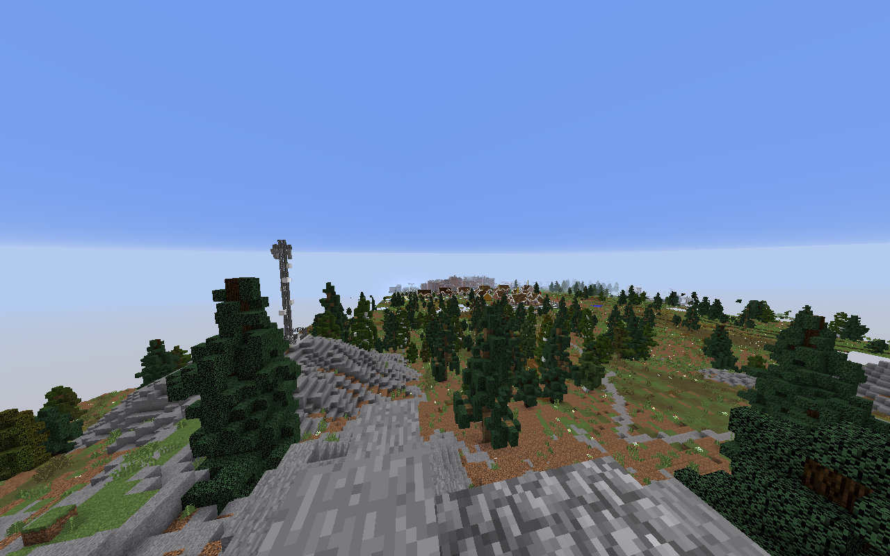
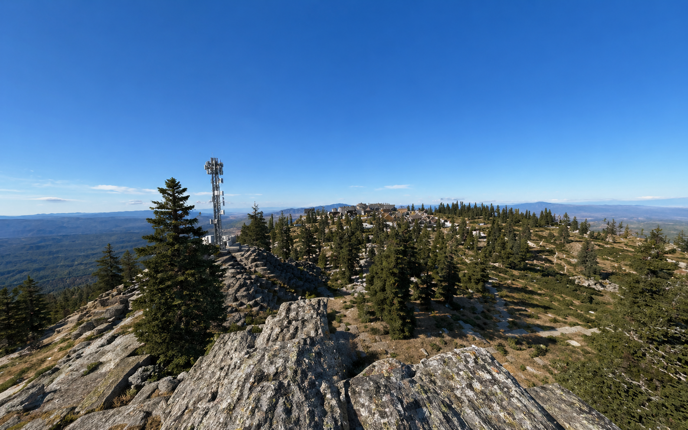
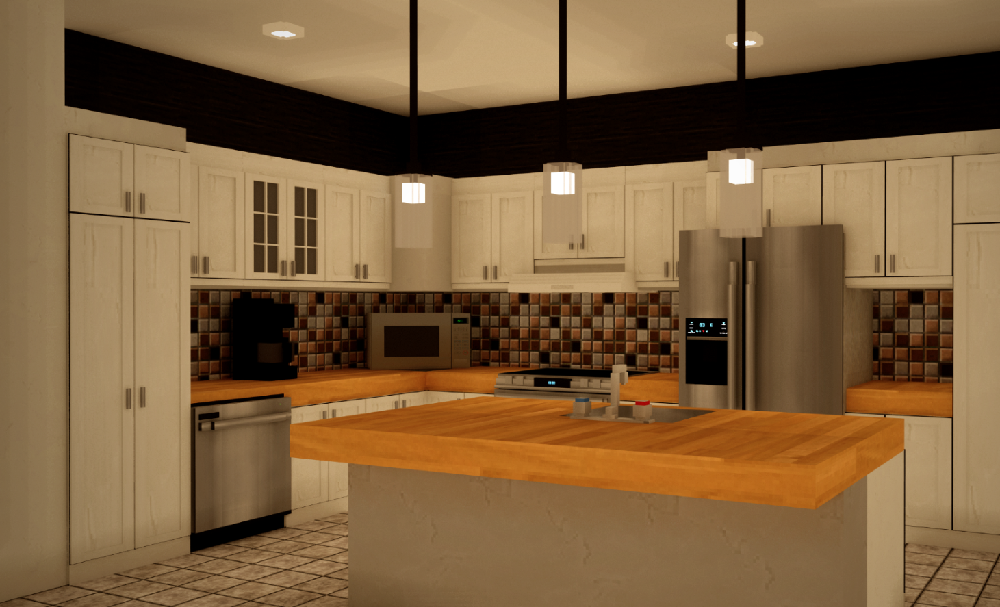
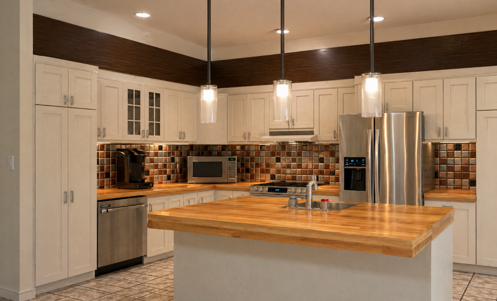
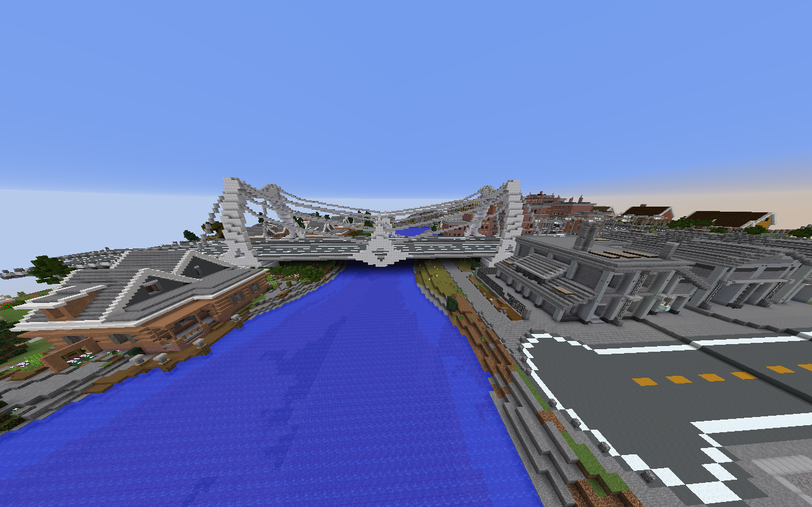
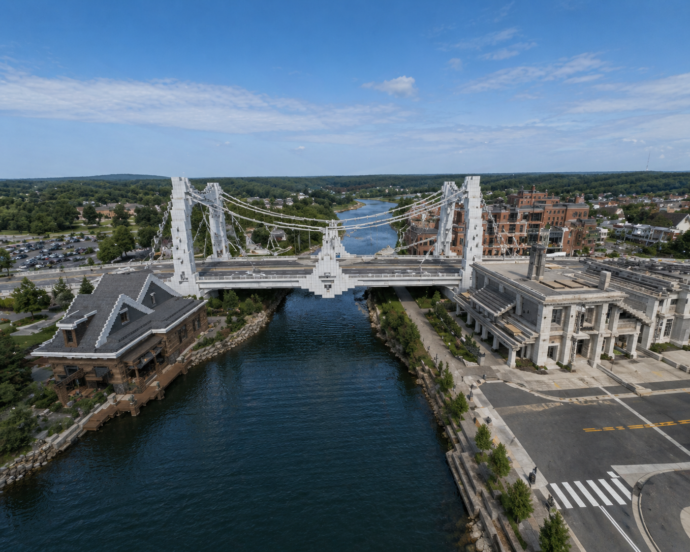

# Minecraft to Realism real time World Model

---

> Real time world model that turns game engine data (camera, motion, depth) into photorealistic video using neural rendering. Focused on low latency, temporal stability, and integrating AI as the rendering layer for interactive environments.

---

  
  

  
  

  
  

---

- Minecraft Client (Java Edition)
- Mod loader (Fabric or Forge)
- Custom rendering mod (framebuffer capture + injection)
- Shader pack (depth, normals, lighting buffers)
- GPU pipeline (RTX / raster + shader outputs)

- Frame extraction (RGB frames)
- Depth buffer extraction
- Normal map extraction (optional)
- Motion vectors / camera delta (optional)
- Player input capture (keyboard, mouse, actions)

- Data bridge (game → AI pipeline)
- Conditioning encoder (format inputs for model)

- world_engine (core world model inference)
- Prompt system (scene style control)
- Temporal frame buffer (history for consistency)
- Latent / diffusion model (frame generation)

- Gaussian Splatting (optional 3D stability layer)
- Depth reconstruction / scene representation
- Real-time splat renderer

- Frame post-processing (denoise, color correction)
- Upscaling (DLSS / AI upscaler)
- Frame interpolation (optional)

- Output renderer (replace or overlay Minecraft frame)
- Sync system (match generation timing to gameplay)
- Async batching (handle multi-frame outputs)

- GPU acceleration (CUDA / TensorRT / quantization)
- Memory management (VRAM buffering, caching)

- Training / fine-tuning pipeline (optional)
- Paired dataset (Minecraft ↔ real-world scenes)
- LoRA / adapter tuning

- UI / debug overlay (latency, buffers, toggles)
- Recording / playback system (testing + dataset generation)
